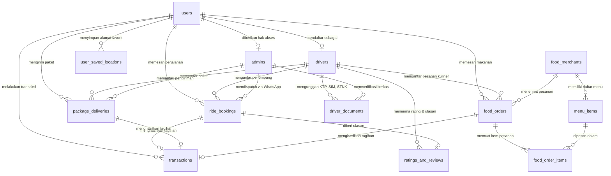

# 🗄️ Dokumentasi Database OTWJek (SheRide, SheCar, SheSend, OTWFood)

Dokumen ini berisi arsitektur database relasional lengkap untuk aplikasi **OTWJek** (ekosistem transportasi dan layanan logistik/kuliner ramah wanita). Skema ini dirancang siap produksi (*production-ready*), kompatibel dengan **PostgreSQL 14+**, **Supabase**, **Neon**, **MySQL 8.0+**, serta **SQLite**.

---

## 📌 1. Daftar Tabel yang Diperlukan & Fungsinya

| No | Nama Tabel | Deskripsi & Alasan Diperlukan |
|---|---|---|
| 1 | `users` | **Data Akun Induk**: Menyimpan identitas semua pengguna (Pelanggan, Mitra Driver Wanita, Operator Admin Dispatch, Merchant). Memuat nama, email, nomor HP (+62), gender (terkunci *Perempuan*), status akun, dan kata sandi terenkripsi. |
| 2 | `drivers` | **Profil Mitra Driver Wanita**: Terhubung 1-to-1 dengan `users`. Menyimpan spesifikasi kendaraan (Motor/Mobil, plat nomor, warna), rating bintang, area operasional (Makassar, Gowa, Maros), koordinat live GPS, dan status ketersediaan (*online/offline/on_trip*). |
| 3 | `driver_documents` | **Verifikasi Berkas Driver**: Tempat penyimpanan bukti foto dokumen resmi: **KTP**, **SIM**, **STNK**, dan SKCK. Setiap dokumen memiliki status verifikasi (*pending, approved, rejected*) dan catatan peninjau dari Admin Dispatch. |
| 4 | `admins` | **Gateway Operator WhatsApp**: Mengatur giliran operator Admin Dispatch (Admin 1, Admin 2, Admin Area Barat, Admin Area Timur). Menyimpan nomor WhatsApp resmi, status online, dan beban chat aktif. |
| 5 | `ride_bookings` | **Pemesanan Perjalanan (SheRide & SheCar)**: Mencatat titik jemput, titik tujuan, koordinat GPS, jarak tempuh (km), durasi perjalanan, perhitungan tarif rupiah, metode bayar (Tunai/QRIS), dan status perjalanan (*searching, on_way, arrived, in_trip, completed*). |
| 6 | `package_deliveries` | **Pemesanan Pengiriman Barang (SheSend)**: Menyimpan detail pengirim & penerima, kategori paket (dokumen, kue, makanan, pakaian), berat barang, instruksi penanganan, bukti foto penjemputan, dan bukti foto penerimaan (*proof of delivery*). |
| 7 | `food_merchants` | **Mitra Kuliner (OTWFood)**: Data restoran/warung makan mitra, kategori (nasi, mie, minuman, cemilan), jam operasional, rating, dan titik lokasi gerai. |
| 8 | `menu_items` | **Menu Makanan & Minuman**: Katalog hidangan dari tiap merchant, harga satuan, status ketersediaan menu (*ready/sold out*), dan foto menu. |
| 9 | `food_orders` & `food_order_items` | **Transaksi Pesanan Makanan**: Keranjang belanja dan riwayat pemesanan makanan, mencakup ongkos kirim, biaya layanan, rincian porsi, dan catatan khusus pesanan. |
| 10 | `transactions` | **Buku Besar Pembayaran**: Mencatat seluruh arus kas transaksi baik untuk perjalanan, pengiriman barang, maupun pesanan kuliner. Menyimpan payload QRIS, nomor invoice unik, dan status settlement (*pending/success/refund*). |
| 11 | `ratings_and_reviews` | **Ulasan & Feedback Bintang**: Penilaian pelanggan terhadap pelayanan mitra pengemudi wanita beserta tag apresiasi (misal: *"Helm Harum"*, *"Ramah"*, *"Mengemudi Santun"*). |
| 12 | `user_saved_locations` | **Bookmark Alamat Favorit**: Menyimpan titik lokasi yang sering dikunjungi oleh pengguna (Rumah, Kampus, Kantor, Kos) untuk mempermudah pemesanan instan 1-klik. |

---

## 🗺️ 2. Entity Relationship Diagram (ERD)



---

## 🚀 3. Cara Menggunakan & Menjalankan Script Database

### Opsi A: Menggunakan Supabase (Direkomendasikan untuk React Vite)
1. Buka dashboard [Supabase](https://supabase.com) dan buat proyek baru.
2. Masuk ke menu **SQL Editor**.
3. Buka file [`database/schema.sql`](file:///d:/FOLDER%20IPUL/CODE/gojek/database/schema.sql), salin seluruh isinya, tempel ke SQL Editor Supabase, lalu tekan tombol **Run**.
4. Buka file [`database/seed.sql`](file:///d:/FOLDER%20IPUL/CODE/gojek/database/seed.sql), salin seluruh isinya, tempel ke SQL Editor Supabase, lalu tekan tombol **Run** untuk memasukkan data driver dan admin awal.
5. Masuk ke **Settings > API**, ambil `SUPABASE_URL` dan `SUPABASE_ANON_KEY` untuk dihubungkan ke aplikasi.

### Opsi B: Menggunakan PostgreSQL Lokal / Docker
```bash
# Jalankan PostgreSQL di docker
docker run --name otwjek-postgres -e POSTGRES_PASSWORD=secret -e POSTGRES_DB=otwjek -p 5432:5432 -d postgres:15

# Jalankan skema dan data awal
psql -h localhost -U postgres -d otwjek -f database/schema.sql
psql -h localhost -U postgres -d otwjek -f database/seed.sql
```

### Opsi C: Menggunakan MySQL 8.0+
Struktur tabel dalam [`database/schema.sql`](file:///d:/FOLDER%20IPUL/CODE/gojek/database/schema.sql) menggunakan tipe data standar ANSI SQL. Ganti tipe data `UUID` menjadi `VARCHAR(36)` atau `CHAR(36)`, dan `TIMESTAMP WITH TIME ZONE` menjadi `DATETIME`.
